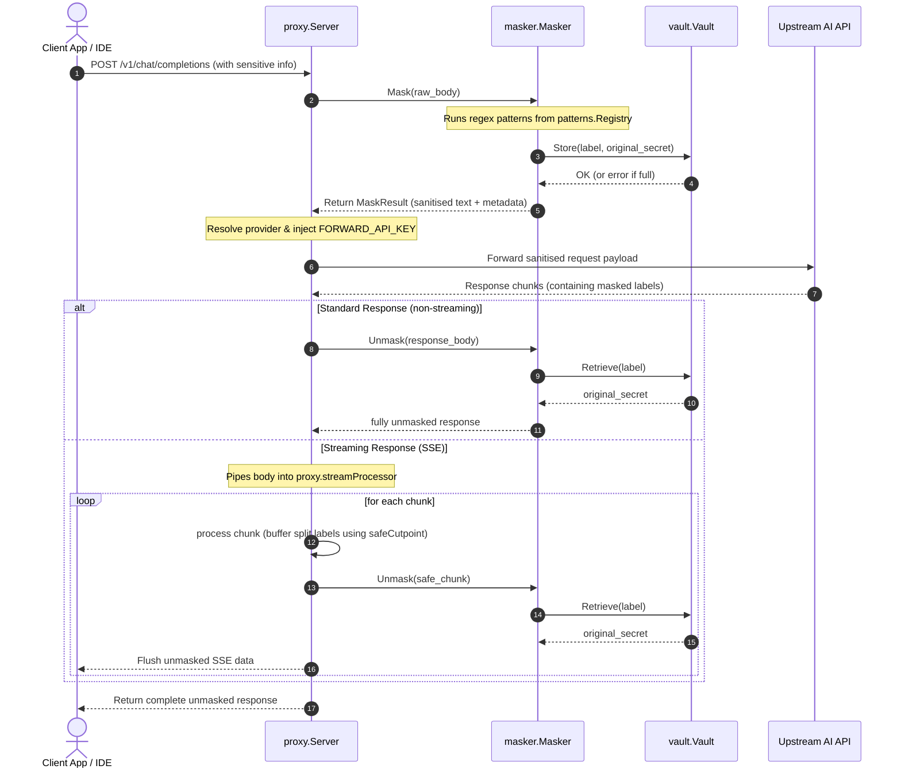

# Technical Architecture — Local AI Firewall

This document provides a deep dive into the internal design, package responsibilities, and data-flow sequences of the Local AI Firewall.

---

## Veri Akış Şeması (Sequence Flow)

The diagram below outlines how a client request containing sensitive data is intercepted, masked, forwarded, and unmasked on return:



---

## Package Structure & Responsibilities

The codebase is split into 7 isolated packages to prevent circular dependencies and follow clean architecture practices:

```
github.com/localai/firewall/
├── config/             - Application settings, default values, env-var loader.
├── vault/              - In-memory thread-safe key-value vault.
├── patterns/           - Regular expressions registry grouped by sensitivity categories.
├── masker/             - Replaces secrets with vault placeholders and vice-versa.
├── providers/          - Protocol adapters mapping upstream endpoints to headers/rules.
├── proxy/              - Reverse proxy server implementation, streaming buffer, handler.
└── metrics/            - Lock-free global counters and metrics HTTP handler.
```

### 1. `config` (Yapılandırma)
Responsible for reading environment variables (`FIREWALL_PORT`, `UPSTREAM_URL`, etc.). It contains a helper `LoadForTest()` which allows unit tests to spin up configurations without requiring system environment setup.

### 2. `vault` (Kasa)
A thread-safe `sync.RWMutex`-guarded storage engine. RWMutex is utilized because unmasking LLM responses triggers many parallel read operations per second, whereas writes only occur on request ingress. It exposes a `Stats()` function implementing `metrics.VaultStatsProvider` to export occupancy data without creating a circular dependency with the `metrics` package.

### 3. `patterns` (Düzenli İfadeler)
Houses the compiled regular expressions (`regexp.Regexp`). Patterns are compiled at application startup inside `init()` to guarantee zero heap-allocation during runtime request evaluation.

### 4. `masker` (Maskeleme Motoru)
Contains the main `Mask()` and `Unmask()` algorithms. It evaluates active patterns based on the configuration and builds `MaskResult` containing metadata and counters.

### 5. `providers` (Sağlayıcı Adaptörleri)
Maps different upstream AI APIs to their protocol requirements. This package exposes a `Registry` of stateless providers. Custom headers are handled via `PrepareHeaders()`, and streaming formats via `IsStream()`.

### 6. `proxy` (Ters Proxy ve Akış İşleyici)
Implements `http.Handler` to run the proxy pipeline. It manages connection timeouts, forwards client headers allowed by safety list, and implements the `streamProcessor` which prevents breaking vault labels split across SSE chunk boundaries.

### 7. `metrics` (Metrikler ve Gözlemlenebilirlik)
Implements atomic lock-free monitoring. Uses `sync/atomic` counters (`int64`) for fast performance under concurrent loads, exposing snapshot outputs via JSON under the `/metrics` path.

---

## Stream Processing & Reassembly Algorithm

When unmasking Server-Sent Events (SSE), chunks can be split in transit at arbitrary byte boundaries:

```
Chunk 1: "Here is your key: [[WIN_PATH_"
Chunk 2: "DEADC0DE]] - keep it safe."
```

If we try to unmask Chunk 1 immediately, the label `[[WIN_PATH_DEADC0DE]]` is truncated, fails to match, and is leaked to the client as plain placeholder. 

**Solution (`safeCutpoint`):**
1. Each incoming chunk is written into `streamProcessor.buf`.
2. The processor searches for the index of the last unclosed opening bracket `[[`.
3. If an unclosed `[[` is found, the processor cuts the buffer at that index:
   - Everything *before* `[[` is safe to unmask and flush to the client immediately.
   - Everything *after* `[[` (the forming label) is retained in the buffer.
4. When Chunk 2 arrives, it is appended to the buffer, completing the label bracket `]]`. The entire string is now safe to flush.
5. On EOF, `Flush()` unconditionally unmasks and clears the remaining buffer.
