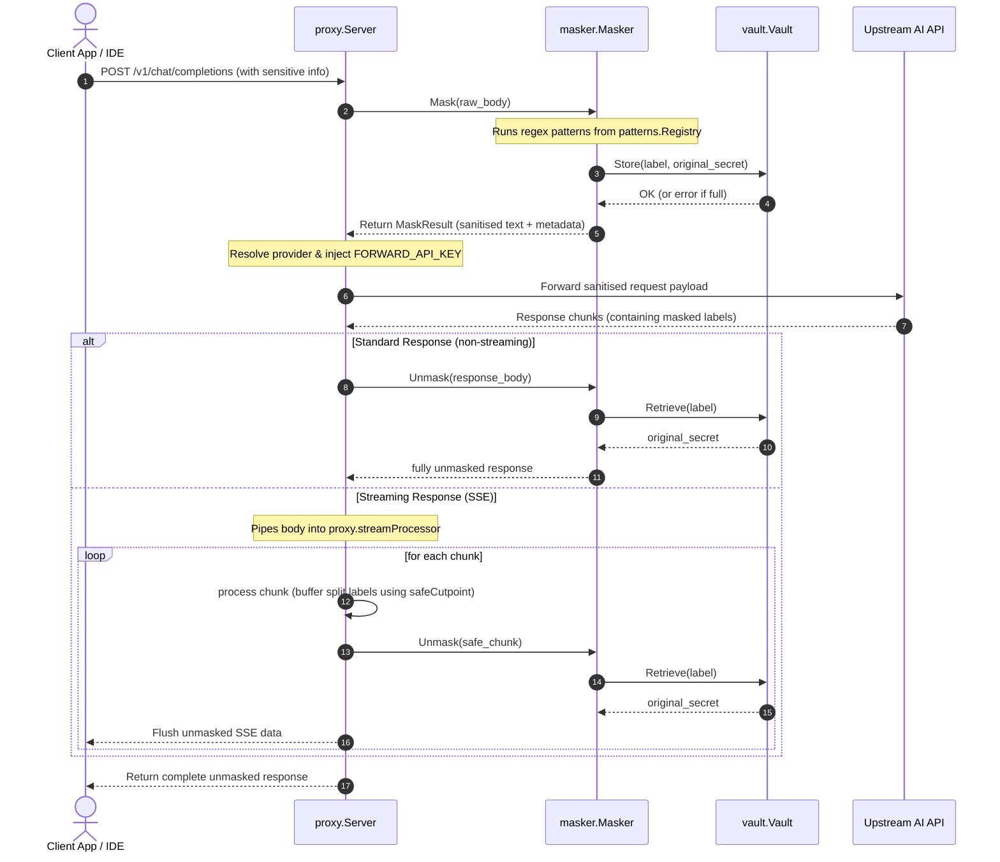

# Technical Architecture — Anonmyz (Local AI Firewall)

This document provides a deep dive into the internal design, package responsibilities, and data-flow sequences of the Local AI Firewall.

---

## Veri Akış Şeması (Sequence Flow)

The diagram below outlines how a client request containing sensitive data is intercepted, masked, forwarded, and unmasked on return:


```mermaid
sequenceDiagram
    autonumber
    actor Client as Client App / IDE
    participant Proxy as proxy.Server
    participant Masker as masker.Masker
    participant Vault as vault.Vault
    participant Upstream as Upstream AI API

    Client->>Proxy: POST /v1/chat/completions (with sensitive info)
    Proxy->>Masker: Mask(raw_body)
    Note over Masker: Runs regex patterns from patterns.Registry
    Masker->>Vault: Store(label, original_secret)
    Vault-->>Masker: OK (or error if full)
    Masker-->>Proxy: Return MaskResult (sanitised text + metadata)
    
    Note over Proxy: Resolve provider & inject FORWARD_API_KEY
    Proxy->>Upstream: Forward sanitised request payload
    Upstream-->>Proxy: Response chunks (containing masked labels)
    
    alt Standard Response (non-streaming)
        Proxy->>Masker: Unmask(response_body)
        Masker->>Vault: Retrieve(label)
        Vault-->>Masker: original_secret
        Masker-->>Proxy: fully unmasked response
    else Streaming Response (SSE)
        Note over Proxy: Pipes body into proxy.streamProcessor
        loop for each chunk
            Proxy->>Proxy: process chunk (buffer split labels using safeCutpoint)
            Proxy->>Masker: Unmask(safe_chunk)
            Masker->>Vault: Retrieve(label)
            Vault-->>Masker: original_secret
            Proxy-->>Client: Flush unmasked SSE data
        end
    end
    
    Proxy-->>Client: Return complete unmasked response
```

---

## Package Structure & Responsibilities

The request pipeline is organized into focused packages, with a transport-independent DLP core shared by the explicit and MITM proxy paths:

```
github.com/3mre0s/ai-firewall/
├── audit/              - Bounded, metadata-only local privacy trace.
├── config/             - Application settings, default values, env-var loader.
├── vault/              - In-memory thread-safe key-value vault.
├── patterns/           - Regular expressions registry grouped by sensitivity categories.
├── masker/             - Replaces secrets with vault placeholders and vice-versa.
├── dlp/                - Request-scoped prepare/restore/stream fail-closed engine.
├── providers/          - Protocol adapters mapping upstream endpoints to headers/rules.
├── proxy/              - Explicit reverse-proxy transport and header policy.
├── metrics/            - Injected lock-free counters and metrics HTTP handler.
├── securitylog/        - Request-correlated JSON security event logging.
└── mitm/               - Optional allow-listed CONNECT/TLS transport.
```

### 1. `config` (Yapılandırma)
Responsible for reading environment variables (`FIREWALL_PORT`, `UPSTREAM_URL`, etc.). `NormalizeUpstreamURL` enforces HTTPS for remote targets, permits HTTP only for loopback development services, and rejects URL userinfo, query parameters, and fragments. `LoadForTest()` lets unit tests create configurations without system environment setup.

### 2. `vault` (Kasa)
A thread-safe `sync.RWMutex`-guarded storage engine. The proxy creates one vault per request/response exchange and wipes it when the response completes. This prevents placeholders observed in one request from restoring secrets belonging to another request.

### 3. `patterns` (Düzenli İfadeler)
Houses the compiled regular expressions (`regexp.Regexp`). Patterns are compiled at application startup inside `init()` to guarantee zero heap-allocation during runtime request evaluation.

### 4. `masker` (Maskeleme Motoru)
Contains the main `Mask()` and `Unmask()` algorithms. It evaluates active patterns based on the configuration and builds `MaskResult` containing metadata and counters.

### 5. `providers` (Sağlayıcı Adaptörleri)
Maps different upstream AI APIs to their protocol requirements. This package exposes a `Registry` of stateless providers. Custom headers are handled via `PrepareHeaders()`, and streaming formats via `IsStream()`.

### 6. `dlp` and `proxy` (Ortak DLP ve HTTP taşıma)
`dlp.Engine` owns request-scoped masking, vault-full fail-close, bounded standard-response restoration, and `StreamProcessor`. Both explicit proxy and MITM use this implementation. `proxy` is responsible for HTTP transport, provider authentication, framing, and header allow-list policy.

### 7. `metrics` and `securitylog` (Gözlemlenebilirlik)
Each server receives its own atomic `metrics.Recorder`; no mutable global counter is used by production paths. `securitylog` emits privacy-safe JSON events with a request ID shared by request, upstream, restoration, and blocking events.

---

## Stream Processing & Reassembly Algorithm

When unmasking Server-Sent Events (SSE), chunks can be split in transit at arbitrary byte boundaries:

```
Chunk 1: "Here is your key: [[WIN_PATH_"
Chunk 2: "DEADC0DE]] - keep it safe."
```

If we try to unmask Chunk 1 immediately, the label `[[WIN_PATH_DEADC0DE]]` is truncated, fails to match, and is leaked to the client as plain placeholder. 

**Solution (`SafeCutpoint`):**
1. Each incoming chunk is written into `streamProcessor.buf`.
2. The processor searches for the index of the last unclosed opening bracket `[[`.
3. If an unclosed `[[` is found, the processor cuts the buffer at that index:
   - Everything *before* `[[` is safe to unmask and flush to the client immediately.
   - Everything *after* `[[` (the forming label) is retained in the buffer.
4. When Chunk 2 arrives, it is appended to the buffer, completing the label bracket `]]`. The entire string is now safe to flush.
5. Before each safe segment is unmasked, it is combined with a bounded 64 KiB raw look-behind and scanned for original values and supported credential formats. A match marks the stream as blocked and suppresses the completing output.
6. On EOF, `Flush()` performs the same inspection, then unmasks and clears the remaining buffer only when it is safe.
