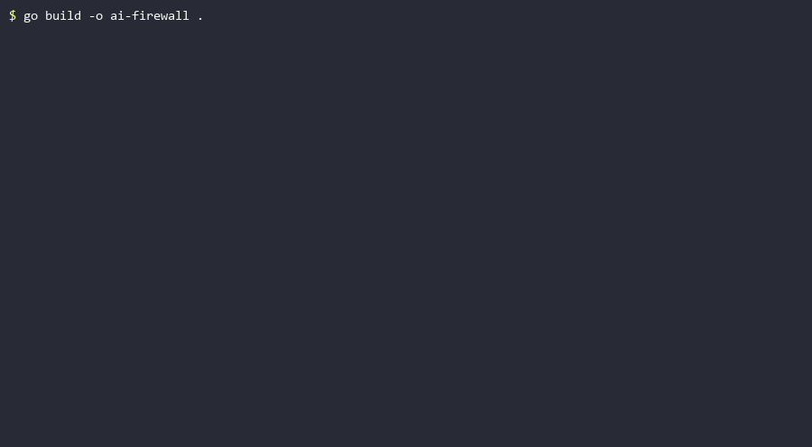

# Local AI Firewall

**Your secrets never leave your machine when you use AI coding tools.** A local proxy that strips API keys, passwords, and personal data out of your prompts before they reach Claude, OpenAI, Gemini, or any other provider — and restores them in the responses. No cloud, no account. Telemetry is disabled by default and opt-in only.

[](#build-from-source)
[](https://www.gnu.org/licenses/agpl-3.0)
[](#running-tests)

---

|                          | Local AI Firewall | Typical cloud gateway (Lakera, Nightfall, Portkey…) |
|--------------------------|--------------------|------------------------------------------------------|
| Sends your data off-machine | No              | Yes — prompts pass through their servers              |
| Install                 | Single binary, no account | Sign up, configure API keys, often SDK integration |
| Cost                    | Free, AGPL-3.0     | Usage-based pricing                                   |
| Works offline-first     | Yes                | No — depends on their service being up                |

---




## Quickstart (3 steps)

**1. Install binary**

```bash
# macOS
brew install 3mre0s/ai-firewall/ai-firewall

# Windows
scoop bucket add ai-firewall https://github.com/3mre0s/scoop-bucket
scoop install ai-firewall

# Linux / manual
curl -L https://github.com/3mre0s/ai_firewall/releases/latest/download/ai-firewall-linux-amd64.tar.gz | tar xz
mv ai-firewall ~/.local/bin/
```

**2. Install VS Code extension**

Download `local-ai-firewall.vsix` from the [latest release](../../releases/latest), then:

```bash
code --install-extension local-ai-firewall.vsix
```

**3. Start**

- `Ctrl+Shift+P` → **Local AI Firewall: Set API Key**
- `Ctrl+Shift+P` → **Local AI Firewall: Start**
- `Ctrl+Shift+P` → **Local AI Firewall: Copy Agent Env** → paste in terminal
- Run `claude`, `cursor`, or any AI coding tool

---

## What makes it different

Most secret-redaction tools ask you to reconfigure each client — change a base URL, run a Docker container, route through a hosted gateway. This one is built to disappear:

- **Zero configuration** — transparent MITM mode intercepts HTTPS directly. Install the local CA once with a single command, and every AI tool on your machine is protected without touching its settings.
- **Telemetry off by default** — nothing phones home unless you set `ANALYTICS_OPT_IN=true` *and* run an official release binary (self-built binaries never send telemetry). No account, no cloud component. When enabled, only a random install ID, version, OS, and arch are sent — never prompts, secrets, or paths. The metrics dashboard is bound to localhost and refuses any non-loopback request.
- **Single static binary** — no runtime, no dependencies, no container. Download one file and run it. Cross-compiled for Linux, macOS, and Windows.
- **Secrets stay in memory** — the token-to-secret mapping lives in an in-memory vault that is never written to disk and is wiped on shutdown.

If you prefer explicit control over transparent interception, an environment-variable proxy mode is available too — see [Quick start](#quick-start).

---

## Why this exists

Every time you paste a stack trace, a config file, or a code snippet into Claude Code, Copilot, Cursor, or ChatGPT, there's a real chance it carries something you didn't mean to share: an API key, a database password, a file path that leaks your username, an email address. That data goes to a server you don't control.

Local AI Firewall sits between your AI tool and the provider. It scans each outgoing request, replaces every detected secret with a short placeholder like `[[OAI_KEY_A1B2C3D4]]`, and forwards the sanitised text. When the response comes back, it swaps the placeholders for the originals before your client sees them. The model gets enough context to stay useful; your secrets stay on your machine.

```
  Your machine
  ┌─────────────────────────────────────────────────────────┐
  │                                                         │
  │  AI tool          Local AI Firewall      AI provider   │
  │  (Claude Code,  ──► [scan & mask] ──────► (Anthropic,  │
  │   Copilot,           replace secrets      OpenAI, …)   │
  │   Cursor …)     ◄─ [restore vault] ◄─────              │
  │                       swap tokens back                  │
  └─────────────────────────────────────────────────────────┘
```

Secrets are masked on the way out and restored on the way back. The provider only ever sees placeholders.

---

## Quick start

### 1. Get the binary

**macOS / Linux (Homebrew):**

```bash
brew install 3mre0s/ai-firewall/ai-firewall
```

**Windows (Scoop):**

```powershell
scoop bucket add ai-firewall https://github.com/3mre0s/scoop-bucket
scoop install ai-firewall
```

**Manual download:** grab the archive for your platform from the [Releases](../../releases) page, extract it, and put `ai-firewall` on your `PATH`.

```bash
# Linux / macOS example
tar -xzf ai-firewall-linux-amd64.tar.gz
chmod +x ai-firewall
mv ai-firewall ~/.local/bin/
```

Verify the download against `checksums.txt` from the same release before running.

### 2a. Transparent mode (recommended — zero client config)

Install the local CA into your system trust store once, then start the firewall in MITM mode. No AI tool needs to be reconfigured.

```bash
# Install the CA (needs sudo on macOS/Linux, Administrator on Windows)
ai-firewall install-ca

# Protect the CA key with a passphrase, then start in transparent mode
export AI_FIREWALL_CA_PASSPHRASE="pick-a-strong-passphrase"
export FORWARD_API_KEY="sk-ant-..."   # your real provider key, or "none" for passthrough
export MITM_ENABLED=true
ai-firewall
```

Point your system or application HTTP proxy at `http://localhost:8082` and you're protected. To remove the CA later: `ai-firewall uninstall-ca`.

In transparent mode your AI tool sends its own credentials as usual — the firewall does **not** touch the `x-api-key` or `Authorization` header, so authentication keeps working exactly as before. The firewall only scans and masks the **request body**; your auth key passes through untouched. (This differs from explicit proxy mode below, where the firewall injects `FORWARD_API_KEY` upstream on your behalf.)

> **Note on the CA passphrase:** if you skip `AI_FIREWALL_CA_PASSPHRASE`, the CA private key is written to disk unencrypted (mode `0600`). That key can sign certificates for any domain on this machine, so setting a passphrase is strongly recommended. The cert directory gets an automatic `.gitignore` to prevent accidental commits.

### 2b. Explicit proxy mode (if you prefer env-var control)

Point your tool's base URL at the firewall instead of intercepting traffic.

```bash
export FORWARD_API_KEY="sk-ant-..."   # real key, injected upstream
ai-firewall                            # defaults to api.anthropic.com on :8080
```

Then in your AI tool:

```bash
# Claude Code
export ANTHROPIC_BASE_URL="http://localhost:8080"
claude

# OpenAI-compatible tools
export OPENAI_BASE_URL="http://localhost:8080"
```

The firewall injects the real `FORWARD_API_KEY` upstream, so your client can send any placeholder key or none at all. To target a different provider, set `UPSTREAM_URL` (e.g. `https://api.openai.com`).

Use `FORWARD_API_KEY=none` if you authenticate with a subscription token (Claude Code Pro/Max uses `ANTHROPIC_AUTH_TOKEN`); the firewall forwards the client's own `Authorization` header unchanged.

---

## What it detects

**28 detection patterns**, covering:

- **API keys & tokens** — Anthropic, OpenAI, Google, GitHub, GitLab, AWS, Stripe, Slack, JWTs, Bearer tokens, PEM private keys
- **Inline credentials** — password assignments, shell `export` secrets
- **System paths** — Unix and Windows filesystem paths that can leak your username
- **Personal data** — email addresses, credit card numbers, IBANs
- **National IDs (checksum-validated)** — Turkish TC Kimlik, Brazilian CPF (mod-11), Spanish DNI (mod-23), Indian Aadhaar (Verhoeff), Italian Codice Fiscale

**14 provider adapters** — Anthropic, OpenAI, Gemini, Azure OpenAI, Groq, Together AI, Perplexity, Mistral, Cohere, DeepSeek, xAI, Ollama, LM Studio, and a generic OpenAI-compatible catch-all.

**IDE extensions** — start, stop, and manage the firewall from VS Code / Cursor (stable) or JetBrains IDEs (beta). The extension auto-discovers the binary and sets the proxy URL for you.

---

## How it works

**Request path**

1. Your AI tool sends a prompt to the firewall.
2. The firewall scans the request body against all patterns and replaces each match with a deterministic token (e.g. `[[GH_PAT_3F9A1C2E]]`).
3. The token→secret mapping is stored in an in-memory vault — never on disk.
4. The sanitised request is forwarded to the real provider with your API key injected.

**Response path**

5. The provider's response arrives (buffered or SSE streaming).
6. The firewall scans for any tokens it placed and substitutes the originals back in.
7. The restored response is returned to the client.

---

## Configuration

All settings come from environment variables. No config file is needed or supported.

| Variable | Default | Description |
|---|---|---|
| `FORWARD_API_KEY` | *(required)* | Real API key forwarded to the upstream provider. Never logged or stored on disk. Set to `"none"` for passthrough mode: the firewall forwards the client's own `Authorization: Bearer` header unchanged. |
| `UPSTREAM_URL` | `https://api.anthropic.com` | Base URL of the upstream AI provider. Trailing slash is stripped automatically. |
| `FIREWALL_PORT` | `8080` | TCP port the API proxy listens on. |
| `PROVIDER_HINT` | *(auto-detect)* | Force a specific provider adapter instead of detecting from `UPSTREAM_URL`. Valid values: `anthropic`, `openai`, `gemini`, `groq`, `together`, `perplexity`, `mistral`, `cohere`, `deepseek`, `xai`, `ollama`, `lmstudio`, `azure`, `generic`. |
| `VAULT_SIZE_LIMIT` | `1000` | Maximum number of token→secret entries held in memory. Once reached, the request is rejected with 507 Insufficient Storage to prevent silent data leakage. Increase the limit or restart the proxy to clear the vault. |
| `MASK_PATHS` | `true` | Detect and mask Unix and Windows filesystem paths. |
| `MASK_EMAILS` | `true` | Detect and mask email addresses (PII). |
| `LOG_LEVEL` | `info` | Verbosity: `silent` \| `info` \| `debug`. |
| `MITM_ENABLED` | `false` | Start the transparent MITM proxy server in addition to the API proxy. |
| `MITM_PORT` | `8082` | TCP port the MITM proxy listens on. |
| `MITM_CERT_DIR` | `~/.ai-firewall` | Directory where `ca.crt` and `ca.key` are stored. Created with `0700` permissions if absent. |
| `AI_FIREWALL_CA_PASSPHRASE` | *(unset)* | Passphrase used to encrypt the CA private key with AES-256-GCM. If unset, the key is stored as a plain `0600` PEM file and a warning is logged at startup. |

---

## CLI commands

```
ai-firewall                Start the proxy server (reads config from env vars).
ai-firewall install-ca     Install the MITM CA certificate into the system trust store.
ai-firewall uninstall-ca   Remove the MITM CA certificate from the system trust store.
ai-firewall version        Print the build version.
ai-firewall help           Show usage.
```

`install-ca` and `uninstall-ca` are idempotent — running them twice is safe and reports the current state.

---

## Security notes

> For the full picture, see **[THREAT_MODEL.md](THREAT_MODEL.md)** (what this tool does and does not protect against) and **[SECURITY.md](SECURITY.md)** (how to report a vulnerability).

### Threat model in brief

This tool protects against **accidentally sending secrets to an AI provider**. It is not a sandbox and does not protect against malware already running as your user. Secrets are masked on a complete request buffer; the in-memory vault is never persisted.

### CA private key protection

When MITM mode is enabled, a self-signed ECDSA P-256 CA (`CN=AI Firewall CA`) is generated and persisted to `MITM_CERT_DIR`. The public certificate (`ca.crt`) is world-readable because clients need it; the private key (`ca.key`) is written `0600` (owner-read only), and the directory gets a `.gitignore` to block accidental commits.

Set `AI_FIREWALL_CA_PASSPHRASE` before first run so the key is stored AES-256-GCM encrypted. If the file is read back later, the same passphrase must be present in the environment.

**Known trade-off:** the AES key is currently derived from the passphrase via a single SHA-256 hash rather than a password-based KDF (scrypt, Argon2id). This offers limited resistance to offline dictionary attacks if the encrypted key is exfiltrated. Mitigating factors: the file is `0600`, the passphrase is never written to disk, and the CA only signs leaf certificates valid for 24 hours. Hardening the derivation to Argon2id is on the roadmap.

### Streaming responses

In SSE streaming mode each chunk is processed as it arrives. A secret whose bytes are split across a chunk boundary may pass through the response unmasked. This is inherent to chunk-by-chunk processing and applies only to the response path — secrets in the request body are always processed on a complete buffer.

### Metrics and dashboard

`/metrics` and `/dashboard` are restricted to `127.0.0.1` and `::1`. Any request from a non-loopback address receives `403 Forbidden`, preventing internal vault state from leaking to the upstream provider or external networks.

### Vault lifecycle

The in-memory vault is cleared on graceful shutdown (`SIGINT` / `SIGTERM`). In-flight requests are allowed to complete before the wipe, preventing a race between active unmask operations and the reset.

---

## Build from source

Requires Go 1.22 or later. No external dependencies — the build works offline after cloning.

```bash
git clone https://github.com/3mre0s/ai_firewall.git
cd ai_firewall
go build -trimpath -ldflags "-s -w" -o ai-firewall .

# Run (FORWARD_API_KEY is required; use "none" for passthrough mode)
export FORWARD_API_KEY="sk-ant-..."   # your real provider key
./ai-firewall
```

---

## Running tests

```bash
go test ./...
go vet ./...
```

---

## IDE Extensions

| IDE | Location | Status |
|---|---|---|
| VS Code / Cursor | `extensions/vscode` | Stable |
| JetBrains IDEs | `extensions/jetbrains` | Beta |

Both extensions auto-discover the `ai-firewall` binary from the workspace root, OS-standard install directories, and `PATH`. See each extension's own README for setup.

---

## Contributing

Contributions are welcome. Please open an issue before starting a large change.

- **New detection pattern** — add a `SensitivePattern` entry in `patterns/patterns.go` and cover it in `masker/masker_test.go`.
- **New provider** — implement the `Provider` interface (or embed `openAICompatProvider`) in `providers/`, register it in `providers/provider.go`, and add it to `hintMap`.

```bash
go test ./...   # must pass
go vet ./...    # must report nothing
```

---

## Telemetry

Disabled by default. **Two conditions must both be true** to send anything:

1. You set `ANALYTICS_OPT_IN=true`
2. You are running an official release binary — self-built binaries never send telemetry because no API key is compiled in

If you build from source (including `go install`), condition 2 is never met, so nothing is ever sent regardless of `ANALYTICS_OPT_IN`.

**Sent** (only when both conditions are true): a random install ID, version, OS, arch.  
**Never sent**: prompts, secrets, file paths, environment variables, or anything passing through the masking pipeline.

The install ID is a random hex string generated with `crypto/rand` and stored in `~/.ai-firewall/telemetry_id`. It has no relation to your identity, machine, or network address. Analytics backend: PostHog (EU region).

---

## License

This project is licensed under the **GNU Affero General Public License v3.0 or later** (AGPL-3.0-or-later) — see [LICENSE](LICENSE) and [NOTICE](NOTICE).

### Commercial licensing

If the AGPL-3.0 terms are not compatible with your use case (e.g., you need to embed Local AI Firewall in a closed-source product or a hosted service without disclosing your source code), a separate commercial license is available.

Commercial licensing inquiries should be kept private. Please reach out via the contact information on the maintainer's GitHub profile, or send a private message directly — do not open a public issue for commercial requests.
