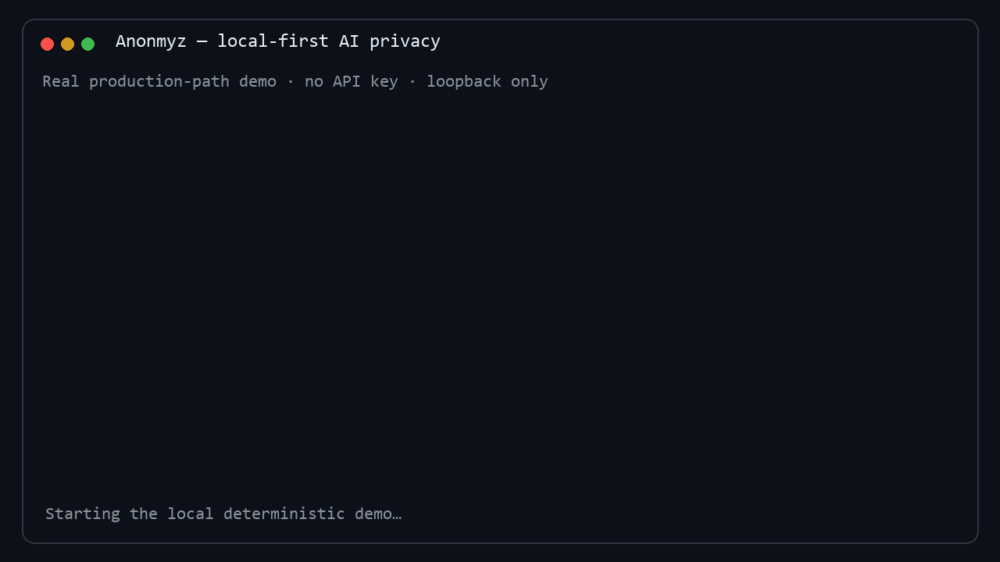

# Anonmyz

**Your coding agent can accidentally send API keys, credentials, personal data, and private file paths to a cloud model. Anonmyz stops that data at the network boundary.**

Anonmyz is a local-first DLP gateway: it detects sensitive values, replaces them with request-scoped placeholders before the request leaves your machine, and restores them locally in the model response. There is no Anonmyz cloud, account, telemetry, or prompt retention.

[](#build-from-source)
[](LICENSE)
[](https://github.com/3mre0s/ai-firewall/actions/workflows/ci.yml)
[](https://github.com/3mre0s/ai-firewall/releases/latest)
[](https://github.com/3mre0s/ai-firewall/stargazers)
[](https://goreportcard.com/report/github.com/3mre0s/ai-firewall)

> **Project status:** Anonmyz is pre-1.0 and actively developed. The explicit proxy, deterministic demo, and VS Code integration are the recommended paths. Transparent MITM and JetBrains support should be evaluated in your environment before broad rollout.

## See the protection in 60 seconds



The recording is captured from the real `anonmyz demo --non-interactive` command. It starts a mock model and Anonmyz on dynamic loopback ports, sends four unmistakably fake secrets through the production masking engine, proves the originals never reached the mock provider, tests a placeholder split across streamed writes, and verifies local restoration. It never contacts an AI provider and needs no API key. Reproduce the capture and GIF with `python docs/make_gif.py --capture` (Go and Pillow required).

## Install with one command

Linux and macOS:

```bash
curl -fsSL https://raw.githubusercontent.com/3mre0s/ai-firewall/main/scripts/install.sh | sh
```

Windows PowerShell (64-bit):

```powershell
irm https://raw.githubusercontent.com/3mre0s/ai-firewall/main/scripts/install.ps1 | iex
```

Both installers download the latest matching release archive, verify it against the release's SHA-256 checksum, and install to a user-owned directory without administrator access. Review [`install.sh`](scripts/install.sh) or [`install.ps1`](scripts/install.ps1) before piping it to a shell. Set `ANONMYZ_VERSION` to pin a release or `ANONMYZ_INSTALL_DIR` to choose the destination.

Then prove the complete local path yourself:

```bash
anonmyz demo --non-interactive
```

Expected result (placeholder suffixes vary because they are generated with cryptographic randomness):

```text
[DETECTED] OpenAI API key
[MASKED]   Replaced with OAI_KEY_6775C841
[DETECTED] GitHub token
[MASKED]   Replaced with GH_PAT_7B31A2C4
[UPSTREAM] Original sensitive values absent; placeholders present
[STREAM]   Split placeholder restored correctly
[RESULT]   4 sensitive values prevented from leaving this machine
```

The command exits non-zero if any privacy assertion fails. Prebuilt archives named `anonmyz-<os>-<arch>` contain the same binary; compatibility archives and the legacy `ai-firewall` name remain available for existing integrations.

## Architecture in 20 seconds

```text
Codex / Cline / Open WebUI / compatible client
                    |
                    v
        Anonmyz on 127.0.0.1 only
  detect -> request-scoped vault -> mask
                    |
                    v
            configured AI provider
                    |
                    v
  buffered stream restore -> local client
                    |
                    +--> bounded local /audit + /dashboard metadata
```

The production path is shared by normal proxy traffic, `anonmyz demo`, and `anonmyz codex`; the demo does not contain a second masking implementation. Placeholder-to-value mappings exist only in a per-request in-memory vault and are reset when the response completes.

## Codex Safe Session

Anonmyz supports Codex sessions authenticated with ChatGPT or an OpenAI API key. It uses a temporary, non-WebSocket Responses API provider configured with Codex's supported one-run `-c` overrides, so it does not edit `~/.codex/config.toml` or read Codex's stored credentials.

```bash
# Inspect the exact temporary routing first. This works even when credentials are missing.
./anonmyz codex --dry-run -- --no-alt-screen

# Live session: use your existing Codex login. `codex login` may use ChatGPT.
codex login
./anonmyz codex -- --no-alt-screen
```

API-key use remains optional: export `OPENAI_API_KEY` (PowerShell: `$env:OPENAI_API_KEY = "..."`) when that is the Codex authentication mode you want.

The launcher detects `codex`, selects a dynamic port, starts the local proxy, forwards arguments after `--`, preserves the child exit code, forwards termination on Unix (Windows console events reach both processes), and shuts the proxy down when Codex exits. The authorization header is passed through because the provider must receive it; Anonmyz protects request bodies, not the credential required for provider authentication.

For ChatGPT login, Codex keeps ownership of its OAuth token and account selector while Anonmyz temporarily selects a provider whose HTTP base is loopback and whose `requires_openai_auth` setting preserves that login. The proxy then forwards sanitized HTTP Responses traffic to Codex's ChatGPT model base. WebSocket support and request compression are disabled for the protected child session so model requests stay on the inspectable plaintext HTTP path.

**Validation status:** live Codex traffic authenticated by an existing ChatGPT subscription completed successfully with a clearly fake GitHub PAT-shaped test value. The audit evidence showed `status=200`, `detections=1`, `prevented=true`, `restored=3`, and `response_blocked=false`; no real secret was used or retained. A separate automated fail-closed probe terminates the loopback proxy during an in-flight Codex request and proves that Codex exits with an error without attempting a direct model fallback.

**Current CLI hardening:** the protected child receives temporary `features.apps=false` and `features.enable_request_compression=false` overrides. Apps/MCP startup is disabled for that child only. Forwarded arguments cannot change the protected model-provider route, the `anonmyz` provider definition, Apps, or request-compression features through `--enable`, `--disable`, `-c`, or `--config` forms. Revalidation with `codex-cli 0.145.0-alpha.27` observed zero unexpected non-loopback connection attempts after the loopback proxy was terminated.

```bash
go run ./scripts/verify-codex-fail-closed
```

Retained, sanitized evidence is under [`evidence/`](evidence/).

## Local privacy trace

While the proxy is running, open `http://127.0.0.1:8080/dashboard` (or the dynamic URL printed by Safe Session). The existing dashboard now shows the newest detections with:

- detected type and placeholder ID;
- proof that the original was removed before forwarding;
- local request ID, UTC timestamp, and masking/restoration processing latency;
- upstream status and streaming restoration result.

`GET /audit` returns the same metadata as JSON. The ring is memory-only, retains at most 200 requests, and never stores request bodies, raw values, or secret hashes.

## Supported platforms and prerequisites

- Linux: amd64 and arm64.
- macOS: Intel amd64 and Apple Silicon arm64.
- Windows: amd64.
- Go 1.22+ only when building from source; release binaries have no runtime dependency.
- A provider credential is required only for live mode. `anonmyz demo` needs none.

## Stop, remove, and troubleshoot

- Demo servers stop automatically. A non-zero result identifies the failed invariant.
- Safe Session stops when Codex exits; press Ctrl+C once to terminate the session and proxy.
- Standalone server mode stops with Ctrl+C. If a fixed port is busy, change `FIREWALL_PORT`; demo and Safe Session choose free ports by default.
- `codex: executable not found`: install Codex and confirm `codex --version` works on `PATH`.
- `no Codex login or API-key credential found`: run `codex login` (ChatGPT is supported) or set `OPENAI_API_KEY`.
- To remove Anonmyz, delete the binary. If you explicitly installed the optional MITM CA, run `anonmyz uninstall-ca` before deleting it. Demo and Codex Safe Session do not install a CA or write temporary configuration.

## OpenAI Build Week extension

Before the submission period, the repository already contained the Go masking engine, request-scoped vault, provider adapters, explicit and MITM proxies, metrics dashboard, IDE integrations, packaging, and tests. This submission adds the production-path deterministic demo, Codex Safe Session launcher, explainable bounded privacy trace, complete placeholder-boundary handling, nested-placeholder hardening, expanded verification, dual-name release path, and judge/submission documentation.

We used Codex with GPT-5.6 to develop, test, review, and security-harden Anonmyz.

Codex with GPT-5.6 was used to inspect the existing architecture and history, verify current Codex CLI/provider configuration against the installed CLI and official source, implement the extension, exercise failure paths, and review the final diff. Human decisions defined the product scope, local-only trust boundary, supported authentication workflows, live-test safety constraints, and retention/security model. See [BUILD_WEEK.md](BUILD_WEEK.md) for the exact submission narrative and recording script.

---

|                             | Anonmyz            | Typical cloud gateway (Lakera, Nightfall, Portkey…)         |
|-----------------------------|--------------------|--------------------------------------------------------------|
| Adds another gateway data processor | No — traffic goes directly from the local proxy to your AI provider | Yes — prompts also pass through the gateway vendor |
| Install                     | Single binary, no account | Sign up, configure API keys, often SDK integration    |
| Cost                        | Free, Apache-2.0   | Usage-based pricing                                          |
| Works offline-first         | Yes                | No — depends on their service being up                       |

---

## Manual installation and VS Code

**1. Download a binary manually**

```bash
# Linux amd64
curl -L https://github.com/3mre0s/ai-firewall/releases/latest/download/anonmyz-linux-amd64.tar.gz | tar xz
mv anonmyz ~/.local/bin/
```

```powershell
# Windows amd64
Invoke-WebRequest https://github.com/3mre0s/ai-firewall/releases/latest/download/anonmyz-windows-amd64.zip -OutFile anonmyz.zip
Expand-Archive anonmyz.zip -DestinationPath .
```

**2. Install VS Code extension**

Download `local-ai-firewall.vsix` from the [latest release](https://github.com/3mre0s/ai-firewall/releases/latest), then:

```bash
code --install-extension local-ai-firewall.vsix
```

**3. Start**

- `Ctrl+Shift+P` → **Local AI Firewall: Set API Key**
- `Ctrl+Shift+P` → **Local AI Firewall: Start**
- `Ctrl+Shift+P` → **Local AI Firewall: Copy Agent Env** → paste in terminal
- Run `claude`, `cursor`, or any AI coding tool

---

## What makes it different

Most secret-redaction tools ask you to reconfigure each client — change a base URL, run a Docker container, route through a hosted gateway. This one is built to disappear:

- **Centralised local control** — transparent MITM mode can intercept HTTPS for an explicit allow-list of AI hosts. It requires installing the local CA and pointing the application or system proxy at the local listener.
- **Zero telemetry** — nothing phones home. No account, no cloud component, no usage tracking. The metrics dashboard is bound to localhost and refuses any non-loopback request.
- **Single static binary** — no runtime, no dependencies, no container. Download one file and run it. Cross-compiled for Linux, macOS, and Windows.
- **Request-scoped vaults** — each token-to-secret mapping lives only in memory for one request/response exchange and is wiped when that exchange completes.

### Trust and verification

- **Audit the masking path:** detection rules live in [`patterns/`](patterns/) and replacement/restoration logic lives in [`masker/`](masker/) and [`vault/`](vault/).
- **No firewall cloud service:** the process contacts only the upstream AI provider you configure; it has no telemetry, analytics, update checker, or hosted control plane.
- **Verify every binary:** releases include `checksums.txt`. Download it with the archive and run `sha256sum --check checksums.txt --ignore-missing` (Linux) or `shasum -a 256 -c checksums.txt` (macOS) before installation.
- **Inspect dependencies:** each release archive has an SPDX JSON SBOM generated by Syft and covered by `checksums.txt`.
- **Verify provenance:** release archives, SBOM metadata, checksums, and the VSIX receive a GitHub/Sigstore build attestation. With GitHub CLI: `gh attestation verify <downloaded-file> -R 3mre0s/ai-firewall`.
- **Review the boundaries:** [`THREAT_MODEL.md`](THREAT_MODEL.md) documents what is and is not protected, including streaming limitations and traffic that bypasses the configured proxy.

If you prefer explicit control over transparent interception, an environment-variable proxy mode is available too — see [Quick start](#quick-start).

---

## Why this exists

Every time you paste a stack trace, a config file, or a code snippet into Claude Code, Copilot, Cursor, or ChatGPT, there's a real chance it carries something you didn't mean to share: an API key, a database password, a file path that leaks your username, an email address. That data goes to a server you don't control.

Anonmyz sits between your AI tool and the provider. It scans each proxied request, replaces detected values with short placeholders such as `[[OAI_KEY_A1B2C3D4]]`, and forwards the resulting text. When the response comes back, it swaps placeholders from that request for the originals before your client sees them. Detection is format-specific and best-effort; values that do not match a supported pattern pass through unchanged.

```
  Your machine
  ┌─────────────────────────────────────────────────────────┐
  │                                                         │
  │  AI tool               Anonmyz            AI provider   │
  │  (Claude Code,  ──► [scan & mask] ──────► (Anthropic,  │
  │   Copilot,           replace secrets      OpenAI, …)   │
  │   Cursor …)     ◄─ [restore vault] ◄─────              │
  │                       swap tokens back                  │
  └─────────────────────────────────────────────────────────┘
```

Detected values are masked on the way out and restored on the way back. The provider sees placeholders for values the configured patterns recognise.

---

## Quick start

### 1. Get the binary

**Manual download:** grab the `anonmyz-<os>-<arch>` archive for your platform from the [Releases](https://github.com/3mre0s/ai-firewall/releases) page, extract it, and put `anonmyz` on your `PATH`. Legacy `ai-firewall` archives remain available for compatibility.

```bash
# Linux / macOS example
tar -xzf anonmyz-linux-amd64.tar.gz
chmod +x anonmyz
mv anonmyz ~/.local/bin/
```

Homebrew and Scoop manifests are maintained in [`packaging/`](packaging/), but package-manager commands will be documented only after the external tap and bucket repositories are published with release checksums.

Verify the download against `checksums.txt` from the same release before running.

### 2a. Transparent mode (recommended — zero client config)

Install the local CA into your system trust store once, then start the firewall in MITM mode. No AI tool needs to be reconfigured.

```bash
# Install the CA (needs sudo on macOS/Linux, Administrator on Windows)
anonmyz install-ca

# Protect the CA key with a passphrase, then start in transparent mode
export AI_FIREWALL_CA_PASSPHRASE="pick-a-strong-passphrase"
export FORWARD_API_KEY="sk-ant-..."   # your real provider key, or "none" for passthrough
export MITM_ENABLED=true
anonmyz
```

Point your system or application HTTP proxy at `http://localhost:8082`. Verify the application actually uses that proxy; traffic that bypasses it is not scanned. To remove the CA later: `anonmyz uninstall-ca`.

In transparent mode your AI tool sends its own credentials as usual — the firewall does **not** touch the `x-api-key` or `Authorization` header, so authentication keeps working exactly as before. The firewall only scans and masks the **request body**; your auth key passes through untouched. (This differs from explicit proxy mode below, where the firewall injects `FORWARD_API_KEY` upstream on your behalf.)

> **Note on the CA passphrase:** if you skip `AI_FIREWALL_CA_PASSPHRASE`, the CA private key is written to disk unencrypted (mode `0600`). That key can sign certificates for any domain on this machine, so setting a passphrase is strongly recommended. The cert directory gets an automatic `.gitignore` to prevent accidental commits.

### 2b. Explicit proxy mode (if you prefer env-var control)

Point your tool's base URL at the firewall instead of intercepting traffic.

```bash
export FORWARD_API_KEY="sk-ant-..."   # real key, injected upstream
anonmyz                                # defaults to api.anthropic.com on :8080
```

Then in your AI tool:

```bash
# Claude Code
export ANTHROPIC_BASE_URL="http://localhost:8080"
claude

# OpenAI-compatible tools
export OPENAI_BASE_URL="http://localhost:8080"
```

The firewall injects the real `FORWARD_API_KEY` upstream, so your client can send any placeholder key or none at all. To target a different provider, set `UPSTREAM_URL` (e.g. `https://api.openai.com`).

Use `FORWARD_API_KEY=none` if you authenticate with a subscription token (Claude Code Pro/Max uses `ANTHROPIC_AUTH_TOKEN`); the firewall forwards the client's own `Authorization` header unchanged.

---

## What it detects

**28 detection patterns**, covering:

- **API keys & tokens** — Anthropic, OpenAI, Google, GitHub, GitLab, AWS, Stripe, Slack, JWTs, Bearer tokens, PEM private keys
- **Inline credentials** — password assignments, shell `export` secrets
- **System paths** — Unix and Windows filesystem paths that can leak your username
- **Personal data** — email addresses, credit card numbers, IBANs
- **National IDs (checksum-validated)** — Turkish TC Kimlik, Brazilian CPF (mod-11), Spanish DNI (mod-23), Indian Aadhaar (Verhoeff), Italian Codice Fiscale

**14 provider adapters** — Anthropic, OpenAI, Gemini, Azure OpenAI, Groq, Together AI, Perplexity, Mistral, Cohere, DeepSeek, xAI, Ollama, LM Studio, and a generic OpenAI-compatible catch-all.

**IDE extensions** — start, stop, and manage the firewall from VS Code / Cursor (stable) or JetBrains IDEs (beta). The extension auto-discovers the binary and sets the proxy URL for you.

---

## How it works

**Request path**

1. Your AI tool sends a prompt to the firewall.
2. The firewall scans the request body against all patterns and replaces each match with a cryptographically random, request-scoped placeholder (e.g. `[[GH_PAT_3F9A1C2E]]`).
3. The token→secret mapping is stored in an in-memory vault — never on disk.
4. The sanitised request is forwarded to the real provider with your API key injected.

**Response path**

5. The provider's response arrives (buffered or SSE streaming).
6. The firewall scans for any tokens it placed and substitutes the originals back in.
7. The restored response is returned to the client.

---

## Configuration

All settings come from environment variables. No config file is needed or supported.

Configuration parsing is fail-closed: an invalid integer or boolean stops startup
with the name of the offending variable instead of silently using a default. Validate
a deployment without opening a listener or printing credentials:

```bash
anonmyz doctor
# alias: anonmyz --check-config
```

| Variable | Default | Description |
|---|---|---|
| `FORWARD_API_KEY` | *(required)* | Real API key forwarded to the upstream provider. Never logged or stored on disk. Set to `"none"` for passthrough mode: the firewall forwards the client's own `Authorization: Bearer` header unchanged. |
| `UPSTREAM_URL` | `https://api.anthropic.com` | Absolute upstream provider URL. Remote targets must use HTTPS; HTTP is accepted only for `localhost` or loopback IPs. Userinfo, query parameters, and fragments are rejected. A trailing slash is stripped. |
| `FIREWALL_PORT` | `8080` | TCP port the API proxy listens on. |
| `PROVIDER_HINT` | *(auto-detect)* | Force a specific provider adapter instead of detecting from `UPSTREAM_URL`. Valid values: `anthropic`, `openai`, `gemini`, `groq`, `together`, `perplexity`, `mistral`, `cohere`, `deepseek`, `xai`, `ollama`, `lmstudio`, `azure`, `generic`. |
| `VAULT_SIZE_LIMIT` | `1000` | Maximum token→secret entries per request. Once reached, that request is rejected with 507 Insufficient Storage to prevent silent data leakage. |
| `MASK_PATHS` | `true` | Detect and mask Unix and Windows filesystem paths. |
| `MASK_EMAILS` | `true` | Detect and mask email addresses (PII). |
| `LOG_LEVEL` | `info` | Verbosity: `silent` \| `info` \| `debug`. |
| `MITM_ENABLED` | `false` | Start the transparent MITM proxy server in addition to the API proxy. |
| `MITM_PORT` | `8082` | TCP port the MITM proxy listens on. |
| `MITM_CERT_DIR` | `~/.ai-firewall` | Directory where `ca.crt` and `ca.key` are stored. Created with `0700` permissions if absent. |
| `AI_FIREWALL_CA_PASSPHRASE` | *(unset)* | Passphrase used to encrypt the CA private key with AES-256-GCM. If unset, the key is stored as a plain `0600` PEM file and a warning is logged at startup. |

---

## CLI commands

```
anonmyz                    Start the proxy server (reads config from env vars).
anonmyz demo               Run the local, key-free security proof.
anonmyz codex -- [args]    Launch a ChatGPT- or API-key-authenticated Codex session through Anonmyz.
anonmyz install-ca         Install the optional MITM CA into the system trust store.
anonmyz uninstall-ca       Remove the optional MITM CA from the system trust store.
anonmyz doctor             Validate configuration without starting a server.
anonmyz --check-config     Alias for doctor.
anonmyz version            Print the build version.
anonmyz help               Show usage.
```

The same commands work under the legacy `ai-firewall` binary name. `install-ca` and `uninstall-ca` are idempotent.

---

## Security notes

> For the full picture, see **[THREAT_MODEL.md](THREAT_MODEL.md)** (what this tool does and does not protect against) and **[SECURITY.md](SECURITY.md)** (how to report a vulnerability).

### Threat model in brief

This tool protects against **accidentally sending secrets to an AI provider**. It is not a sandbox and does not protect against malware already running as your user. Secrets are masked on a complete request buffer; the in-memory vault is never persisted.

### CA private key protection

When MITM mode is enabled, a self-signed ECDSA P-256 CA (`CN=AI Firewall CA`) is generated and persisted to `MITM_CERT_DIR`. The public certificate (`ca.crt`) is world-readable because clients need it; the private key (`ca.key`) is written `0600` (owner-read only), and the directory gets a `.gitignore` to block accidental commits.

Set `AI_FIREWALL_CA_PASSPHRASE` before first run so the key is stored AES-256-GCM encrypted. If the file is read back later, the same passphrase must be present in the environment.

New encrypted CA keys use PBKDF2-HMAC-SHA-256 with a random salt and 210,000 iterations before AES-256-GCM encryption. Legacy encrypted keys remain readable for upgrade compatibility. The key file is `0600`, and the passphrase is never written to disk.

### Streaming responses

SSE is processed through a bounded rolling buffer that retains incomplete placeholder prefixes, including a network split between the two opening brackets. A separate 64 KiB raw look-behind detects supported credentials split across network reads; byte-boundary tests cover both placeholder restoration and raw-credential blocking. When a match completes, Anonmyz suppresses the completing output and terminates the stream. Bytes already flushed before a later malicious value cannot be recalled. Unknown or malformed placeholders remain masked rather than restoring an unrelated request's value.

Non-streaming upstream responses are capped at 64 MiB in both explicit-proxy and MITM paths to bound memory use. Oversized bodies are suppressed; the MITM path returns `502 Bad Gateway`.

### Metrics and dashboard

`/metrics`, `/audit`, and `/dashboard` are restricted to `127.0.0.1` and `::1`. Any request from a non-loopback address receives `403 Forbidden`. Audit retention is a bounded, memory-only 200-request ring with metadata only.

### Vault lifecycle

Each request/response exchange has an isolated in-memory vault. It is wiped when that exchange completes, so a placeholder from one request cannot restore a secret from another request.

---

## Build from source

Requires Go 1.22 or later.

```bash
git clone https://github.com/3mre0s/ai-firewall.git
cd ai-firewall
go build -o anonmyz .
./anonmyz demo --non-interactive
```

---

## Running tests

```bash
make test
make vet
make vuln
make benchmark
```

CI runs race tests, stores coverage and benchmark artefacts, scans Go/npm dependencies, tests both IDE integrations, packages the VSIX, and cross-compiles the supported release matrix.

---

## IDE Extensions

| IDE | Location | Status |
|---|---|---|
| VS Code / Cursor | `extensions/vscode` | Stable |
| JetBrains IDEs | `extensions/jetbrains` | Beta |

Both extensions auto-discover the `ai-firewall` binary from trusted global configuration, OS-standard install directories, and `PATH`. Workspace/project-root binaries are intentionally ignored because the selected process receives the provider credential. See each extension's own README for setup.

---

## Contributing

Contributions are welcome. Please open an issue before starting a large change.

See [`CONTRIBUTING.md`](CONTRIBUTING.md) for the complete local setup, test workflow, and pull-request checklist.

- **New detection pattern** — add a `SensitivePattern` entry in `patterns/patterns.go` and cover it in `masker/masker_test.go`.
- **New provider** — implement the `Provider` interface (or embed `openAICompatProvider`) in `providers/`, register it in `providers/provider.go`, and add it to `hintMap`.

```bash
go test ./...   # must pass
go vet ./...    # must report nothing
```

---

## License

Apache-2.0 — see [LICENSE](LICENSE) and [NOTICE](NOTICE).
